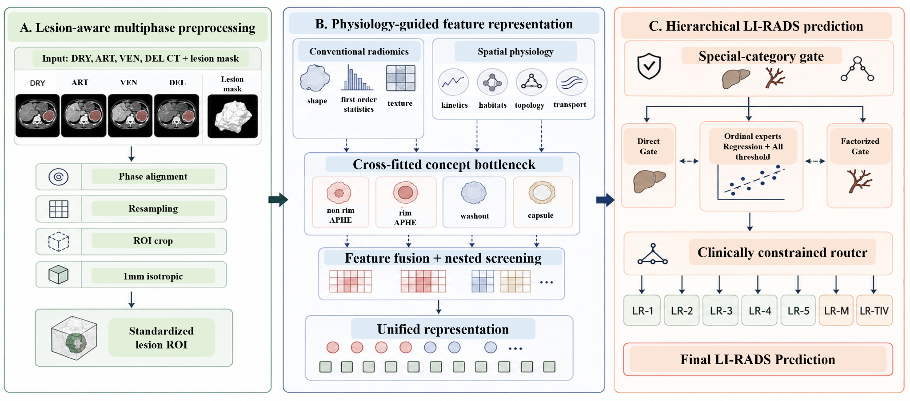

<div align="center">

# PHORA: Physiology-Guided Hierarchical Ordinal Radiomics for LI-RADS Classification in Multiphase CT

**MICCAI 2026 · AMPLIFAI Challenge**

[](#installation)
[](#method-at-a-glance)
[](#data)
[](#amplifai-challenge-submission)

**Dharini Raghavan¹ · Advait Madabhushi² · Amritpal Singh² · Mendel Lebowitz² · Gourav Modanwal² · Anant Madabhushi²**  
¹ Georgia Institute of Technology · ² Emory University

</div>

<p align="center">
  
</p>

## Why PHORA?

LI-RADS is not naturally a flat seven-class problem. **LR-1→LR-5 are ordered**, while **LR-M and LR-TIV are special clinical categories** that leave the ordinal HCC spectrum. PHORA mirrors that structure: it learns interpretable multiphase imaging descriptors, distills training-only radiologist concepts into inference-time latent features, and combines special-category gating with ordinal experts through a clinically constrained router.

> PHORA asks *what the lesion looks like and how it enhances*, learns *which LI-RADS concepts are present*, decides whether the case belongs to the ordinal LR-1–LR-5 pathway or a special category, and then estimates ordinal severity when appropriate.

## Method at a glance

```text
DRY / ART / VEN / DEL CT + supplied lesion mask
                       │
        ┌──────────────┼───────────────┐
        │              │               │
  handcrafted     spatial/temporal   local context
   radiomics        physiology          + OT
        └──────────────┼───────────────┘
                       │
             ~900 candidate features
                       │
            nested fold-wise screening
                       │
              140 imaging features
                       │
       cross-fitted concept + burden heads
             6 probabilities + 5 burdens
                       │
           24 clinical interaction terms
                       │
              175-D unified vector
                       │
      ┌────────────────┼─────────────────┐
      │                │                 │
 direct gate      factorized gate    ordinal experts
                                   regression + all-threshold
      └────────────────┼─────────────────┘
                       │
          clinically constrained router
                       │
       LR-1 · LR-2 · LR-3 · LR-4 · LR-5 · LR-M · LR-TIV
```

The unified representation is an interpretable **tabular concatenation**, not a neural embedding. See [`docs/METHOD.md`](docs/METHOD.md) for the full routing formulation and [`docs/FEATURES.md`](docs/FEATURES.md) for the feature-space audit.

## Public validation results

The table below is from the official 59-case public validation split. Private challenge-test metrics are intentionally not published here.

| Method | Composite ↑ | Adj. QWK ↑ | SCR ↑ | Macro-F1 ↑ |
|---|---:|---:|---:|---:|
| Extra Trees | **0.763** | **0.785** | 0.635 | 0.400 |
| Cross-fitted multi-view stack | 0.734 | 0.741 | **0.694** | 0.405 |
| **PHORA** | **0.718** | **0.738** | **0.605** | 0.355 |
| Random Forest | 0.705 | 0.709 | 0.683 | 0.279 |
| Simple hierarchical XGB | 0.692 | 0.703 | 0.629 | 0.306 |
| Elastic-net logistic | 0.690 | 0.702 | 0.620 | **0.457** |
| Flat XGBoost | 0.687 | 0.686 | 0.692 | 0.283 |

PHORA improved over flat XGBoost and the simple hierarchical baseline, while Extra Trees remained the strongest deployable model on this small public holdout. The repository therefore reports the full baseline/ablation story rather than hiding stronger classical comparisons.

<details>
<summary><b>Concept recovery</b></summary>

| Clinical concept | AUROC | AUPRC |
|---|---:|---:|
| Non-rim APHE | **0.915** | **0.960** |
| Delayed washout | 0.905 | 0.835 |
| Venous washout | 0.870 | 0.787 |
| Venous capsule | 0.854 | 0.731 |
| Delayed capsule | 0.718 | 0.164 |
| Rim APHE | 0.702 | 0.245 |

</details>

## Repository layout

```text
PHORA/
├── assets/                         # architecture figure
├── challenge/
│   ├── PHORA_AMPLIFAI_Codabench.zip
│   └── codabench_source/           # exact portable inference source/model
├── configs/                        # fast and paper run presets
├── docs/                           # data, method, reproduction, Codabench docs
├── notebooks/
│   └── 01_reproduce_paper.ipynb    # canonical end-to-end notebook
├── results/                        # released public CV/validation outputs
├── scripts/
│   ├── run_reproduction.py
│   ├── show_results.py
│   ├── verify_results.py
│   └── build_codabench_submission.py
├── src/phora/
│   ├── spatial_features.py
│   ├── handcrafted_radiomics.py
│   ├── context_features.py
│   ├── modeling.py
│   └── metrics.py
├── tests/
├── legacy/                         # development files kept for provenance only
├── pyproject.toml
├── requirements.txt
└── README.md
```

## Installation

```bash
git clone <YOUR-GITHUB-URL>
cd PHORA
python -m venv .venv

# Windows
.venv\Scripts\activate

# Linux / macOS
# source .venv/bin/activate

pip install -e ".[dev]"
```

The final paper pipeline uses an **in-house IBSI-inspired radiomics implementation**; PyRadiomics is not required.

## Data

Download the public AMPLIFAI training/validation release from the official challenge and place it in a local directory:

```text
data/
├── batch_001.zip
├── batch_002.zip
├── batch_003.zip
├── batch_004.zip
├── train_metadata.csv
└── val_metadata.csv
```

Raw medical images are not committed. See [`docs/DATA.md`](docs/DATA.md) for case layout and licensing notes.

## Reproduce the experiments

### 1. Quick smoke test

```bash
python scripts/run_reproduction.py --data-root data --mode fast
```

### 2. Full paper experiment matrix

```bash
python scripts/run_reproduction.py --data-root data --mode paper
```

Paper mode runs the frozen settings used for the manuscript: 140 screened imaging features, three ensemble seeds, 5,000 router trials, 10,000 bootstrap replicates, architecture/feature ablations, repeated-seed CV, and source-robustness analysis. Feature extraction is cached.

Or use the Makefile:

```bash
make install
make fast DATA_ROOT=/path/to/amplifai
make paper DATA_ROOT=/path/to/amplifai
make results
make verify
```

Detailed instructions are in [`docs/REPRODUCIBILITY.md`](docs/REPRODUCIBILITY.md).

## AMPLIFAI challenge submission

The ready-to-upload portable Codabench program is included at:

```text
challenge/PHORA_AMPLIFAI_Codabench.zip
```

Its exact unpacked source is in `challenge/codabench_source/`. It bundles a lightweight NIfTI reader and pure-Python evaluator for the fitted XGBoost trees, requiring no network access or runtime installation in the challenge container. See [`docs/CODABENCH.md`](docs/CODABENCH.md).

## Reproducibility notes

- **No private test labels** are used anywhere in training, tuning, or analysis.
- Training-only radiologist concept/mask annotations are used solely as auxiliary supervision; validation/test predictors receive only model-estimated concepts and burdens.
- Feature selection and concept/burden distillation are cross-fitted to avoid leakage.
- The 59-case public validation split is held out from router tuning.
- The non-deployable oracle-concept model in the released tables is an analysis-only upper bound.
- Public derived feature tables are included for auditability; consult the AMPLIFAI data license before redistributing them.

## Citation

If you use PHORA, please cite the associated manuscript (bibliographic details can be updated after proceedings publication):

```bibtex
@inproceedings{raghavan2026phora,
  title     = {PHORA: Physiology-Guided Hierarchical Ordinal Radiomics for LI-RADS Classification in Multiphase CT},
  author    = {Raghavan, Dharini and Madabhushi, Advait and Singh, Amritpal and Lebowitz, Mendel and Modanwal, Gourav and Madabhushi, Anant},
  booktitle = {MICCAI 2026 AMPLIFAI Challenge},
  year      = {2026}
}
```

## Acknowledgments

We thank the AMPLIFAI organizers and annotating radiologists for the challenge data and evaluation framework.

---

<div align="center">
<b>PHORA</b> · interpretable multiphase physiology · clinically structured supervision · ordinal LI-RADS reasoning
</div>
